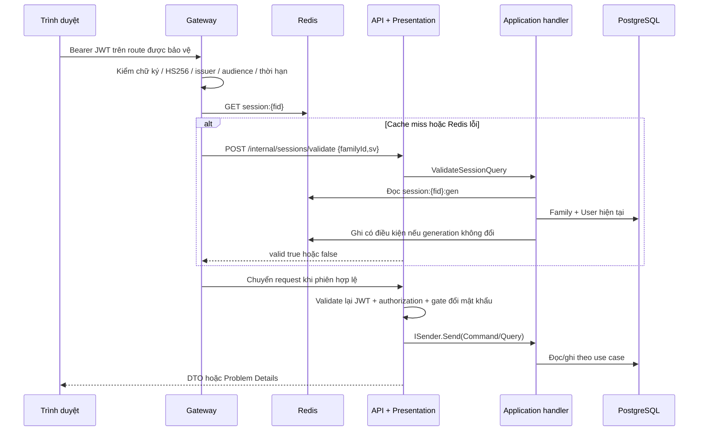

# Thiết kế code hiện tại: xác thực, phiên và Gateway

Ngày bắt đầu review: 2026-10-03; hoàn tất tài liệu: 2026-10-04. Phạm vi: backend `IdentityAccess`, Gateway, cookie/CSRF và hạ tầng cache được gọi trực tiếp bởi các luồng auth. Đây là mô tả **code đang có**, không phải đặc tả thay thế hay tuyên bố mọi tính năng trong spec đã hoàn tất. Không sửa source; không đọc secret; agent phụ không tự chạy build/test. Kết quả kiểm tra tập trung đã được đối chiếu output log mới: build thành công (0 lỗi, 6 cảnh báo), unit 230/230 PASS, integration 224 PASS và 8 Skip/232. Chi tiết và giới hạn xem §12 cùng [spec.md §8](D:/hospital_management/benh_vien_be/docs/reviews/2026-10-03-thiet-ke-code-hien-tai/spec.md:1).

Nguồn đối chiếu: [AGENTS.md](D:/hospital_management/AGENTS.md), [spec auth 2026-09-23](D:/hospital_management/benh_vien_be/docs/superpowers/plans/2026-09-23-auth-permission-redesign/spec.md), [spec V2 2026-09-30](D:/hospital_management/benh_vien_be/docs/superpowers/plans/2026-09-30-auth-va-luong-kham-v2/spec.md). Khi spec cũ nói chỉ khóa family → token, phải đọc cùng V2 §5.1: **User → SessionFamilies theo Id tăng → RefreshTokens**. NV-03 của BRD là phân quyền, không gán nhầm thành mã nghiệp vụ đăng nhập; phần này đối chiếu điều khoản auth của hai spec. Không suy ra nghiệp vụ lâm sàng từ code auth.

## 1. Phân chia trách nhiệm thực tế

- **Gateway** kiểm JWT và trạng thái phiên trước định tuyến; chỉ đọc cache phiên, không cấp token và không quyết định quyền nghiệp vụ. Trình tự middleware: forwarded headers → correlation → bỏ `X-Internal-*` → request log → rate limit IP → authentication → authorization → proxy. Bằng chứng: [Gateway Program.cs:42](D:/hospital_management/benh_vien_be/src/QuanLyBenhVien.Gateway/Program.cs:42).
- **API** validate lại JWT nhưng chủ động **không tra phiên** trong JWT authentication. Đây là thiết kế ghi rõ trong [JwtAuthenticationSetup.cs:16](D:/hospital_management/benh_vien_be/src/QuanLyBenhVien.API/Security/JwtAuthenticationSetup.cs:16), dựa vào điều kiện triển khai API không mở trực tiếp ra Internet. Authorization và gate bắt đổi mật khẩu chạy trước endpoint: [API Program.cs:48](D:/hospital_management/benh_vien_be/src/QuanLyBenhVien.API/Program.cs:48).
- **Presentation** khai route, CSRF metadata, cookie, bind DTO và map `Result` sang HTTP; **Application** điều phối transaction; **Domain** giữ bất biến phiên; **Persistence** khóa/nạp entity và ghi dữ liệu; **Infrastructure** hash/token/Redis/worker.
- `ICurrentUser` đọc `sub`, `fid`, `sv` từ principal, không lấy user/family từ body: [CurrentUser.cs:8](D:/hospital_management/benh_vien_be/src/QuanLyBenhVien.API/Security/CurrentUser.cs:8). Claims phản ánh JWT; những mutation nhạy cảm kiểm lại User/family trong DB sau khóa.

**Lý do thiết kế (suy luận từ code và spec):** chặn request hết phiên sớm ở Gateway, không buộc từng endpoint tự kiểm JWT, đồng thời để nghiệp vụ và quyền nằm trong API. Việc validate chữ ký lần hai giảm phụ thuộc vào header nhận dạng do proxy gửi. Đổi lại, điều kiện cách ly mạng của API là một phần của tính đúng bảo mật, không chỉ là tối ưu triển khai.

## 2. Hợp đồng route đang tồn tại

Nguồn chung: [AuthEndpoints.cs:23](D:/hospital_management/benh_vien_be/src/QuanLyBenhVien.Presentation/Endpoints/V1/Auth/AuthEndpoints.cs:23), [InternalSessionEndpoints.cs:17](D:/hospital_management/benh_vien_be/src/QuanLyBenhVien.Presentation/Endpoints/Internal/Sessions/InternalSessionEndpoints.cs:17). Gateway khai riêng login/refresh/logout là `anonymous`, rồi catch-all `/api/v1/auth/{**catch-all}` cho các route bảo vệ: [appsettings.json:16](D:/hospital_management/benh_vien_be/src/QuanLyBenhVien.Gateway/appsettings.json:16). Bảng dưới chỉ mô tả route thực sự được map trong Presentation.

| Route | Điều kiện trước handler | Kết quả thành công | Lỗi chính |
|---|---|---|---|
| `POST /api/v1/auth/login` | Anonymous; `{email,password}` hợp lệ; rate limit Gateway | `200 {accessToken,expiresAtUtc,mustChangePassword}` + hai cookie | 400 `validation_failed`; 401 `unauthenticated`; 429 `rate_limited` ở Gateway |
| `POST /api/v1/auth/refresh` | Anonymous; cookie nhận diện được family thì Origin + CSRF của family cookie | 200 body access như login, refresh cookie mới, cùng family/hạn | 401 + xóa cookie; 403 `csrf_failed`; 429 ở Gateway |
| `POST /api/v1/auth/logout` | Anonymous; Origin + CSRF nếu cookie nhận diện được family | 204 + xóa hai cookie | 403 khi family nhận diện được nhưng Origin/CSRF sai |
| `POST /api/v1/auth/logout-all` | Bearer + Origin + CSRF của claim `fid`; được gọi khi phải đổi mật khẩu | 204 + xóa hai cookie | 401 nếu user/family/sv không hợp lệ; 403 CSRF |
| `POST /api/v1/auth/change-password` | Bearer; `{currentPassword,newPassword}`; Origin + CSRF của claim `fid`; được miễn gate | 200 access token mới với `mustChangePassword:false`; giữ refresh cookie | 400 field errors; 401 user/family/sv; 403 CSRF |
| `GET /api/v1/auth/me` | Bearer; được miễn gate đổi mật khẩu | 200 DTO thông tin, roles, permissions, cờ đổi mật khẩu | 401 khi không xác thực/không có user; lỗi phụ thuộc Gateway có thể 503 |
| `POST /internal/sessions/validate` | API nội bộ; `X-Internal-Key`; `{familyId,sv}` | 200 `{valid,userId,absExp}` | 401 thiếu/sai key; lỗi DB/hạ tầng qua exception handler |

Endpoint auth không yêu cầu quyền `users.manage`/`roles.manage`; đây là thao tác với credential/phiên của bản thân. Endpoint nội bộ dùng `.AllowAnonymous()` để không đòi JWT của người dùng, nhưng có `InternalApiKeyFilter`, ẩn khỏi OpenAPI và không có route `/internal/*` trong Gateway. Lỗi dự kiến từ handler trả `Result`; cookie refresh chỉ xuất hiện trong `Set-Cookie`, không có trong JSON. Lỗi bất ngờ API trả 500 `internal_error`, không tự chuyển mọi lỗi DB thành 503: [GlobalExceptionHandler.cs:14](D:/hospital_management/benh_vien_be/src/QuanLyBenhVien.API/Middleware/GlobalExceptionHandler.cs:14).

## 3. Dữ liệu và kỹ thuật nền

### 3.1 User, SessionFamily và RefreshToken

`User` giữ `PasswordHash`, `IsActive`, `MustChangePassword`, `SecurityVersion`, `LastLoginAt`, `xmin` qua `RowVersion`. Đổi mật khẩu làm `SecurityVersion++`, xóa cờ bắt đổi và phát domain event: [User.cs:56](D:/hospital_management/benh_vien_be/src/QuanLyBenhVien.Domain/Identity/User.cs:56). `SecurityVersion` không tăng theo mọi refresh; nó vô hiệu access token phát trước sự kiện an toàn như đổi mật khẩu/khóa tài khoản.

Một lần login tạo một `SessionFamily`, gồm nhiều refresh token qua thời gian. Family có trạng thái `Active`/`Revoked`, lý do và thời điểm revoke, IP/User-Agent lúc login, thời điểm refresh cuối. `AbsoluteExpiresAtUtc = login + 7 ngày` là hằng Domain, không trượt theo hoạt động: [SessionFamily.cs:8](D:/hospital_management/benh_vien_be/src/QuanLyBenhVien.Domain/Identity/Sessions/SessionFamily.cs:8). Không có idle timeout trong luồng này.

`RefreshToken` lưu hash, thời điểm tạo/hết hạn/consumed/revoked và `ReplacedById`. `IsUsable` xét consumed/revoked; thời hạn chung được kiểm ở family trước rotation. Repository chỉ nạp token đã trình cộng token chưa consumed/chưa revoked; `Tokens` không phải toàn bộ lịch sử. Khi revoke, token đang dùng được sẽ bị đánh dấu revoked; token consumed giữ lịch sử consumed. Family revoked là điều kiện chặn toàn bộ token của family: [RefreshToken.cs:16](D:/hospital_management/benh_vien_be/src/QuanLyBenhVien.Domain/Identity/Sessions/RefreshToken.cs:16), [SessionFamily.cs:21](D:/hospital_management/benh_vien_be/src/QuanLyBenhVien.Domain/Identity/Sessions/SessionFamily.cs:21).

DB có unique index trên `TokenHash`; FK User → Family → Tokens và index `(UserId,Status)`. Cấu hình hiện tại **không có partial unique index ép một token chưa consumed/revoked mỗi family**: [RefreshTokenConfiguration.cs:14](D:/hospital_management/benh_vien_be/src/QuanLyBenhVien.Persistence/Configurations/Identity/RefreshTokenConfiguration.cs:14), [SessionFamilyConfiguration.cs:19](D:/hospital_management/benh_vien_be/src/QuanLyBenhVien.Persistence/Configurations/Identity/SessionFamilyConfiguration.cs:19). Luồng chuẩn dùng khóa family và aggregate để giữ một token sống; đây là đảm bảo của ứng dụng, không phải ràng buộc độc lập của DB.

### 3.2 Password, access token và refresh token

- Password được hash/verify bởi wrapper `Microsoft.AspNetCore.Identity.PasswordHasher<User>`; code không tự viết thuật toán và không cấu hình tham số riêng: [PasswordHasher.cs:9](D:/hospital_management/benh_vien_be/src/QuanLyBenhVien.Infrastructure/Security/PasswordHasher.cs:9). Review này không khẳng định số iteration mặc định của framework. `SuccessRehashNeeded` được coi là thành công nhưng chưa có luồng nâng cấp hash tự động.
- Với email không tồn tại, `SimulateVerify` chạy verify trên dummy hash để giảm chênh lệch thời gian giữa không có user và sai mật khẩu. Message bên ngoài giống nhau cho không có user/sai password/inactive; audit nội bộ phân biệt nguyên nhân. Đây là giảm tín hiệu dò tài khoản, không chứng minh mọi nhánh HTTP có cùng thời gian.
- JWT dùng HS256, có `sub`, `fid`, `sv`, `jti` và thông tin thời gian/issuer/audience; không có email/role/permission. `jti` dùng `Guid.NewGuid()` là mã nhận dạng token, không phải khóa bản ghi PostgreSQL: [JwtTokenService.cs:20](D:/hospital_management/benh_vien_be/src/QuanLyBenhVien.Infrastructure/Security/JwtTokenService.cs:20).
- Hạn JWT lấy từ `JwtOptions.AccessTokenMinutes`, mặc định 15; đây là giá trị cấu hình, không hằng bất biến. Cả Gateway/API pin HS256 và `ClockSkew=30s`. Signing key đối xứng được chia sẻ để API phát và cả hai verify. Startup validate độ dài key, CSRF key và internal key nhưng chưa validate khoảng `AccessTokenMinutes`, issuer/audience: [DependencyInjection.cs:29](D:/hospital_management/benh_vien_be/src/QuanLyBenhVien.Infrastructure/DependencyInjection.cs:29), [JwtOptions.cs:8](D:/hospital_management/benh_vien_be/src/QuanLyBenhVien.Infrastructure/Security/JwtOptions.cs:8).
- Refresh token dùng `RandomNumberGenerator.GetBytes(32)` → Base64Url. DB chỉ giữ SHA-256 dạng hex lowercase, không giữ plaintext: [RefreshTokenGenerator.cs:10](D:/hospital_management/benh_vien_be/src/QuanLyBenhVien.Infrastructure/Security/RefreshTokenGenerator.cs:10). **Lý do (suy luận):** token ngẫu nhiên đủ lớn nên hash nhanh phục vụ tra cứu, còn password do người dùng chọn cần hasher chuyên dụng. Không coi password và refresh token là cùng một loại bí mật.

## 4. Luồng đăng nhập

Nguồn thực thi: [LoginCommandHandler.cs:29](D:/hospital_management/benh_vien_be/src/QuanLyBenhVien.Application/Features/Auth/Login/LoginCommandHandler.cs:29), [LoginCommandValidator.cs:9](D:/hospital_management/benh_vien_be/src/QuanLyBenhVien.Application/Features/Auth/Login/LoginCommandValidator.cs:9), [AuthEndpoints.cs:55](D:/hospital_management/benh_vien_be/src/QuanLyBenhVien.Presentation/Endpoints/V1/Auth/AuthEndpoints.cs:55).

1. Gateway áp dụng giới hạn `POST /api/v1/auth/login`: 10 request/phút/IP. Vượt giới hạn trả 429 trước API. Không còn limiter theo email trong handler, phù hợp quyết định V2.
2. Endpoint bind email/password thành `LoginCommand`. Validator yêu cầu email không rỗng, đúng định dạng, tối đa 256; password không rỗng, tối đa 128. Login không áp dụng chính sách độ mạnh của password mới và không trim password.
3. Normalize email bằng trim + lowercase invariant. `GetByEmailAsync` dùng `AsNoTracking` để định vị user, chưa tin hash/active của kết quả này.
4. Không có user: dummy verify → thêm audit `auth.login/Failed/EmailNotFound` → `SaveChangesAsync` ghi audit → 401 chung. Không mở transaction tường minh riêng vì chỉ có một lần ghi; audit lỗi ghi DB thì không trả 401 thành công giả.
5. Có user: bắt đầu transaction, khóa `Users` bằng `FOR UPDATE`, nạp User mới sau khóa. Kiểm password trước `IsActive`. Sai password/inactive: ghi audit Failed với ActorId user, SaveChanges + commit rồi trả 401. Không dùng exception để làm rollback mất audit thất bại.
6. Hợp lệ: lấy `now` từ `TimeProvider`, tạo refresh random/hash, `SessionFamily.Start`, ghi `LastLoginAt`, thêm family và audit `auth.login/Succeeded`. SaveChanges rồi commit một transaction.
7. Sau commit, ghi `session:{fid}` có điều kiện **generation chưa tồn tại** (`CacheGeneration.None`). Nếu thao tác khóa tài khoản/logout-all đã invalidation family mới này trước cache write, generation ngăn login ghi lại trạng thái cũ. Redis lỗi dự kiến được adapter bắt, Warning và vẫn tiếp tục; Gateway sẽ hỏi DB khi miss.
8. Phát JWT bằng `user.SecurityVersion`, CSRF theo family; endpoint ghi hai cookie với thời gian còn lại của family và trả DTO chỉ chứa access token/hạn/cờ đổi mật khẩu.

**Vì sao khóa User (đã nêu trong V2):** login không được dùng mật khẩu/`IsActive` đã bị đổi bởi request khác. Cùng khóa User còn đưa login và logout-all về một thứ tự rõ: login đã tạo family trước lượt logout-all sẽ bị revoke; login thực sự sau logout-all có thể tạo family mới. Repository lookup no-tracking tránh trả entity cũ trong change tracker: [UserRepository.cs:17](D:/hospital_management/benh_vien_be/src/QuanLyBenhVien.Persistence/Repositories/Identity/UserRepository.cs:17).

**Ưu điểm:** credential được kiểm trên dữ liệu sau khóa; audit/session/LastLogin ghi cùng transaction; phản hồi không phân biệt lỗi credential; Redis không nằm trong transaction. **Đánh đổi:** hash password được verify trong khi giữ khóa User; nhiều login cùng một user phải tuần tự, có thể kéo dài thời gian chờ. Khi response mất sau commit, family đã tạo vẫn tồn tại nhưng client chưa nhận token/cookie; không có cơ chế hoàn tác family chỉ vì mạng mất phản hồi.

Bằng chứng test hiện có: [LoginTests.cs:36](D:/hospital_management/benh_vien_be/tests/QuanLyBenhVien.IntegrationTests/Auth/LoginTests.cs:36) kiểm body/cookie; `WrongPassword_UnknownEmail_InactiveAccount_AllLookIdentical` (:64); `Failure_IsAuditedWithReasonAndActor` (:90); `Success_CachesSessionForGatewayAndAudits` (:116); `RedisDown_LoginStillSucceeds` (:156). `LoginAndSessionCacheTests` kiểm generation.None chống ghi sau invalidation. Các test không Skip thuộc suite được chạy tập trung; xem §12.

## 5. Luồng refresh: rotation, reuse và đồng thời

Nguồn: [RefreshSessionCommandHandler.cs:28](D:/hospital_management/benh_vien_be/src/QuanLyBenhVien.Application/Features/Auth/RefreshSession/RefreshSessionCommandHandler.cs:28), [SessionFamily.cs:45](D:/hospital_management/benh_vien_be/src/QuanLyBenhVien.Domain/Identity/Sessions/SessionFamily.cs:45), [SessionRepository.cs:33](D:/hospital_management/benh_vien_be/src/QuanLyBenhVien.Persistence/Repositories/Identity/SessionRepository.cs:33).

1. Gateway cho anonymous và rate limit 30 `POST /refresh`/phút/IP. Không yêu cầu access JWT còn hạn, nên có thể khôi phục khi F5 hoặc JWT hết hạn.
2. CSRF filter hash `__Host-rt`, lookup cả token cũ/consumed để tìm family. Nếu nhận diện được family, Origin phải trong allowlist và header CSRF phải đúng family. Sai trả 403 **trước handler**, không rotation/revoke, không xóa cookie. Cookie thiếu/rác không nhận diện được thì để handler trả lỗi thích hợp.
3. Handler thiếu token → 401. Hash token, lookup token join family không tracking để định vị User/family. Không có hoặc family đã Revoked → 401, không đổi revoke reason, không ghi thêm reuse audit.
4. Mở transaction; khóa User → family → **token đã trình**. Repository khóa bằng câu SQL riêng, rồi Include token đã trình và mọi token usable. Token consumed không được bỏ khỏi tập nạp chỉ vì có token mới. Tra trước khóa chỉ định vị, sau khóa kiểm lại User tồn tại/active, family tồn tại và thuộc User.
5. Sinh token kế tiếp, lấy now rồi gọi `Rotate`. Family không active/hết hạn trả 401, không mutate; dispose transaction chưa commit dẫn đến rollback. Family còn active nhưng token presented đã consumed/revoked → `Revoke(Reuse)` và đi nhánh strict reuse.
6. **Nhánh rotation:** đánh dấu token cũ `ConsumedAtUtc`, ghi `ReplacedById`, thêm token mới cùng hạn tuyệt đối, cập nhật `LastRefreshedAtUtc`. `SaveChangesAsync(CancellationToken.None)` + commit; không thêm AuditRecord thành công. Sau commit phát access token theo sv của User đã khóa, tạo CSRF cùng family, endpoint viết cookie token mới. Không kéo dài 7 ngày, không tạo family mới, không cần cache write phiên vì trạng thái family/sv/hạn không đổi.
7. **Nhánh reuse:** enqueue invalidation session, audit `auth.refresh.reuse/Denied/RefreshTokenReuse`, SaveChanges + commit bằng `CancellationToken.None`; gọi flush sau commit, rồi trả 401. Endpoint thấy lỗi Unauthorized sẽ xóa hai cookie. Nếu eviction lỗi, công việc DB còn để worker xử lý; không rollback revoke đã commit.
8. Hai request cùng token: request đầu consume/commit, request sau chờ khóa User/family và thấy consumed → reuse → revoke cả family. Vì vậy **đúng một rotation có thể thành công nhưng family cuối cùng bị thu hồi**; access token vừa nhận từ request đầu cũng mất hiệu lực sau invalidation. Không có grace window cho request lặp.

**Lý do (spec + suy luận):** rotation giảm khả năng dùng mã refresh đã lộ; strict reuse coi token cũ trình lại là dấu hiệu token bị copy. Khóa tuần tự và kiểm token gốc ngăn hai request cùng tạo hai token hợp lệ. Commit nhánh reuse trước 401 đảm bảo phản hồi từ chối không làm rollback hành động phòng vệ.

**Giới hạn cần hiểu:** mạng mất response sau rotation không thể khôi phục token mới từ DB vì DB chỉ có hash. Gửi lại token cũ dẫn đến revoke, buộc login lại; đây là đánh đổi cố ý của strict reuse. FE phải kiểm soát refresh đồng thời, kể cả nhiều tab. `CancellationToken.None` sau khi đã xác định mutation an toàn giúp không bỏ dở commit khi client ngắt, nhưng request hủy vẫn có thể hoàn tất ghi DB và mất response; không phải bảo đảm thao tác chưa xảy ra.

Bằng chứng test: [RefreshRotationTests.cs:79](D:/hospital_management/benh_vien_be/tests/QuanLyBenhVien.IntegrationTests/Auth/RefreshRotationTests.cs:79) rotation/hạn; :111 reuse commit+eviction; :139 token revoked ở active family; :157 giữ reason Logout; :201 hai refresh đồng thời; :217 sv mới khi chờ khóa User. [RefreshHttpTests.cs:181](D:/hospital_management/benh_vien_be/tests/QuanLyBenhVien.IntegrationTests/Auth/RefreshHttpTests.cs:181) 401/xóa cookie/revoke; [LogoutRefreshInteropTests.cs:123](D:/hospital_management/benh_vien_be/tests/QuanLyBenhVien.IntegrationTests/Auth/LogoutRefreshInteropTests.cs:123) mất response rồi replay. Các test không Skip thuộc suite chạy tập trung; xem §12.

## 6. Logout và LogoutAll

### 6.1 Logout một family

Nguồn: [LogoutCommandHandler.cs:26](D:/hospital_management/benh_vien_be/src/QuanLyBenhVien.Application/Features/Auth/Logout/LogoutCommandHandler.cs:26), [AuthEndpoints.cs:89](D:/hospital_management/benh_vien_be/src/QuanLyBenhVien.Presentation/Endpoints/V1/Auth/AuthEndpoints.cs:89).

1. Không cần Bearer, dùng cookie để còn logout được khi access JWT hết hạn. CSRF theo **family của cookie**, không theo JWT của family khác.
2. Thiếu cookie/lookup không thấy/family đã revoked → `Result.Success`, không mutate, endpoint vẫn xóa hai cookie và trả 204. Với cookie nhận diện được family, filter vẫn yêu cầu Origin/CSRF trước handler.
3. Family Active: mở transaction, khóa User → family → token presented; kiểm ownership và trạng thái lần nữa. Nếu bị request khác revoke trong lúc chờ khóa, trả success và không audit success trùng.
4. `family.Revoke(Logout)` thu hồi token usable; enqueue session invalidation và audit `auth.logout/Succeeded`; SaveChanges + commit bằng `CancellationToken.None`.
5. Ra khỏi transaction, flush invalidation; lỗi flush chỉ Warning/worker retry. Endpoint clear cookies → 204. DB save/commit lỗi là lỗi hạ tầng, không giả 204 và không tự clear cookie ở nhánh đó.

Logout nhận **token cũ đã consumed** trong family vẫn revoke đúng family; không gọi Rotate và không biến logout thành reuse. Nó không kiểm User.IsActive hay family còn hạn trước revoke: cookie nhận diện được một family vẫn Active thì có thể dọn family đó, dù User inactive hoặc hết hạn. Điều này không cho phép cấp lại token.

**Ưu điểm:** idempotent khi gọi lặp, không khóa người dùng trong tình trạng access token hết hạn, không động tới family khác. **Đánh đổi:** browser chỉ clear local cookie sau khi server trả thành công; nếu mạng lỗi, phải phân biệt trạng thái UI với hành động revoke có thể đã commit. Không thể hứa 204 đồng nghĩa mọi token đã bị chặn tức thì khi cache flush thất bại.

### 6.2 LogoutAll

Nguồn: [LogoutAllCommandHandler.cs:26](D:/hospital_management/benh_vien_be/src/QuanLyBenhVien.Application/Features/Auth/LogoutAll/LogoutAllCommandHandler.cs:26).

1. Bắt buộc có `sub`, `fid`, `sv` qua `ICurrentUser`; Origin/CSRF theo `fid` đã qua filter. Được miễn gate bắt đổi mật khẩu.
2. Transaction khóa User; kiểm tồn tại, active và sv khớp. Khóa mọi family Status=Active của User theo Id tăng; nạp token usable. Tìm family hiện tại trong tập đó và kiểm còn hạn bằng `IsActiveAt`.
3. User/sv/current family không hợp lệ → 401 và rollback; không revoke các family khác chỉ vì request có userId hợp lệ.
4. Revoke từng family Active bằng `LogoutAll`, enqueue mỗi session key; ghi một audit `auth.logout_all/Succeeded` cho User. Tập Active có thể gồm family đã hết hạn nhưng chưa chuyển Status; các family đó cũng được revoke. Mã audit lấy từ hằng [AuditActions.cs:8](D:/hospital_management/benh_vien_be/src/QuanLyBenhVien.Application/Common/Auditing/AuditActions.cs:8), khác cách viết route `/logout-all`.
5. SaveChanges + commit bằng `CancellationToken.None`, dispose transaction; flush; endpoint clear cookie → 204. Family của người khác không thuộc truy vấn.

**Lý do (suy luận):** kiểm lại current family và sv bảo vệ trường hợp Gateway còn cache cũ; khóa User tuần tự hóa logout-all với login mới. Đây không phải khóa vĩnh viễn tài khoản: login sau commit vẫn được phép, đúng khác biệt giữa revoke phiên và deactivate User.

Bằng chứng test: [LogoutTests.cs:54](D:/hospital_management/benh_vien_be/tests/QuanLyBenhVien.IntegrationTests/Auth/LogoutTests.cs:54) chỉ revoke family hiện tại; :75 lặp không audit trùng; :97 rollback nếu DB save lỗi; :116 mọi family cùng User; :172 current family hết hạn; :201 race login/logout-all. [LogoutSessionTests.cs:34](D:/hospital_management/benh_vien_be/tests/QuanLyBenhVien.IntegrationTests/Gateway/LogoutSessionTests.cs:34) Gateway chặn token sau logout; :88 logout-all không ảnh hưởng User khác. Được kiểm tra trong suite chạy tập trung, trừ test Skip; xem §12.

## 7. Đổi mật khẩu và gate lần đầu

Nguồn: [ChangePasswordCommandHandler.cs:29](D:/hospital_management/benh_vien_be/src/QuanLyBenhVien.Application/Features/Auth/ChangePassword/ChangePasswordCommandHandler.cs:29), [ChangePasswordCommandValidator.cs:10](D:/hospital_management/benh_vien_be/src/QuanLyBenhVien.Application/Features/Auth/ChangePassword/ChangePasswordCommandValidator.cs:10), [PasswordChangeGateMiddleware.cs:15](D:/hospital_management/benh_vien_be/src/QuanLyBenhVien.API/Security/PasswordChangeGateMiddleware.cs:15).

1. Bearer authenticated, Origin/CSRF theo fid; validator bắt current password không rỗng, new password 10–128. Không trim password; xác nhận nhập lại do FE xử lý.
2. Handler đòi cả userId/familyId/sv; mở transaction, khóa User, kiểm active và sv mới nhất. Khóa mọi family Active theo Id tăng, nạp token usable; current family phải thuộc user, active và chưa hết hạn. Cache Gateway stale không giúp vượt các kiểm tra DB này.
3. Verify current password trên hash đã khóa. Sai: audit `auth.password.change/Failed/InvalidCurrentPassword`, SaveChanges + commit bằng `CancellationToken.None`, trả 400 `validation_failed` với `errors.currentPassword`. Không trả 401 và không dùng limiter email.
4. Verify new password với hash hiện tại để chặn cùng plaintext; sau đó kiểm password chứa email local-part không phân biệt hoa thường. Vi phạm trả 400 `errors.newPassword`, không mutation. Length do validator kiểm trước transaction. Hai nhánh này không ghi failed audit riêng trong handler.
5. Hash new password, `User.ChangePassword` tăng sv và xóa MustChangePassword. Revoke **family khác** bằng `PasswordChanged`; giữ current family, current refresh token và hạn tuyệt đối.
6. Enqueue invalidation **mọi family kể cả hiện tại** vì cache current còn sv cũ; thêm `perm:{uid}` vì cờ MustChangePassword nằm trong permission cache. Ghi success audit cùng transaction; SaveChanges + commit bằng `CancellationToken.None`.
7. Sau dispose transaction, flush invalidation; lỗi flush không báo như mật khẩu chưa đổi. Cấp access token mới với sv mới và current fid; trả `mustChangePassword:false`. Endpoint không viết/xóa refresh cookie, không rotation. Request tiếp theo Gateway miss cache sẽ hỏi API để nạp sv mới.

**Gate:** chạy sau UseAuthorization. Endpoint anonymous và metadata `AllowWhilePasswordChangeRequired` đi tiếp; me/change-password/logout/logout-all là các ngoại lệ hiện có. Route bảo vệ khác đọc `IPermissionService.GetAsync(userId)`: null → 401; MustChangePassword → 403 `password_change_required`; lỗi đọc lan lên exception handler. Không có ngoại lệ admin. Do gate sau authorization, endpoint có policy quyền có thể trả forbidden trước gate; không mặc định mọi 403 của tài khoản cần đổi password đều mang cùng code.

**Ưu điểm:** thay đổi password, sv, revoke family khác, audit và hàng chờ cache là một transaction; current session tiếp tục được dùng; new token không phát trước commit. **Đánh đổi:** giữ khóa User/families trong khi verify/hash, và cache cũ có cửa sổ tồn tại nếu flush lỗi. Khi cache session còn sv cũ, **JWT cũ có thể qua Gateway còn JWT mới bị 401** cho tới worker drain; đã được spec cũ §4.3 cập nhật rõ, không gọi đó là thu hồi tức thì. Handler đổi password và logout-all vẫn có kiểm tra DB để tự bảo vệ.

Bằng chứng test: [ChangePasswordFlowTests.cs:102](D:/hospital_management/benh_vien_be/tests/QuanLyBenhVien.IntegrationTests/Auth/ChangePasswordFlowTests.cs:102) 400 field và failed audit; :160 family revoked cùng sv bị chặn; :177 mutation/caches/audit/response; :226 sáu lần sai vẫn 400 theo quyết định bỏ limiter. [PasswordChangeRefreshTests.cs:23](D:/hospital_management/benh_vien_be/tests/QuanLyBenhVien.IntegrationTests/Auth/PasswordChangeRefreshTests.cs:23) current family refresh được, family khác không. [PasswordChangeSessionTests.cs:91](D:/hospital_management/benh_vien_be/tests/QuanLyBenhVien.IntegrationTests/Gateway/PasswordChangeSessionTests.cs:91) cố ý chứng minh old token chỉ bị chặn sau worker khi flush lỗi. Được kiểm tra trong suite chạy tập trung, trừ test Skip; xem §12.

## 8. Me và kiểm phiên nội bộ

### 8.1 `GET /api/v1/auth/me`

1. Gateway kiểm JWT/phiên. API validate JWT, RequireAuthorization; miễn gate để FE đọc cờ MustChangePassword và biết phải đổi mật khẩu.
2. Handler chỉ đòi `ICurrentUser.UserId`, gọi `IAuthReadService.GetMeAsync`; không có User → 401. Handler không kiểm lại fid/sv hay session state.
3. Read service `AsNoTracking` đọc thủ công profile, tính quyền qua `EffectivePermissions.LoadAsync`, đọc role refs có Id/Code/Name, sắp permission bằng ordinal. Quyền hiệu lực = quyền từ mọi role **Union** quyền grant trực tiếp; inactive User có tập permissions rỗng. Không dùng permission Redis cho response Me; `passwordHash` không được select vào DTO.
4. Trả `{id,email,fullName,avatarUrl,roles:[{id,code,name}],permissions,mustChangePassword}`. Ba nhóm profile/access/roles là nhiều truy vấn, không có transaction snapshot bao quanh; có thể phản ánh các thời điểm commit khác nhau nếu admin đổi quyền đồng thời.

Nguồn: [GetMeQueryHandler.cs:11](D:/hospital_management/benh_vien_be/src/QuanLyBenhVien.Application/Features/Auth/GetMe/GetMeQueryHandler.cs:11), [AuthReadService.cs:28](D:/hospital_management/benh_vien_be/src/QuanLyBenhVien.Persistence/ReadServices/Identity/AuthReadService.cs:28), [EffectivePermissions.cs:10](D:/hospital_management/benh_vien_be/src/QuanLyBenhVien.Persistence/ReadServices/Identity/EffectivePermissions.cs:10). Test DTO không hash/quyền: [MeAndSessionsTests.cs:41](D:/hospital_management/benh_vien_be/tests/QuanLyBenhVien.IntegrationTests/Auth/MeAndSessionsTests.cs:41), Được kiểm tra trong suite chạy tập trung, trừ test Skip; xem §12.

**Lý do (suy luận):** Me cho FE một ảnh quyền mới từ DB và giữ JWT không chứa quyền dễ lỗi thời. Tuy nhiên Me là thông tin để dựng UI, không là authorization thay thế; không được dùng response roles như chứng cứ quyền tài nguyên.

### 8.2 `POST /internal/sessions/validate`

1. Filter hash giá trị key cấu hình và header bằng SHA-256 rồi `FixedTimeEquals`; thiếu/sai key → 401. Không tin `X-Internal-Key` client bên ngoài: Gateway xóa mọi header bắt đầu `X-Internal-` trước proxy.
2. Handler đọc **generation trước DB**. Redis lỗi → generation null; vẫn đọc DB, không ghi cache sau đó.
3. Read service join family → User, không tracking. Hợp lệ khi family Active, hạn tuyệt đối > now, User active và `Users.SecurityVersion == request.sv`.
4. Không hợp lệ → 200 `{valid:false,userId:null,absExp:null}`, không ghi cache. Đây là kết quả nghiệp vụ, không lỗi HTTP hạ tầng.
5. Hợp lệ → ghi `session:{fid}` với TTL bằng hạn family còn lại **chỉ khi generation vẫn bằng giá trị đã đọc**. Generation đổi vì revoke trong khoảng DB-read/cache-write thì bỏ write; query vẫn trả kết quả đã đọc. Cơ chế này bảo vệ cache lâu dài, không khóa một request validation với một request revoke thành một transaction xuyên DB/Redis.
6. Trả 200 `{valid:true,userId,absExp}`; Gateway hiện chỉ đọc `valid`. API là bên duy nhất ghi session cache.

Nguồn: [InternalApiKeyFilter.cs:15](D:/hospital_management/benh_vien_be/src/QuanLyBenhVien.Presentation/Http/InternalApiKeyFilter.cs:15), [ValidateSessionQueryHandler.cs:14](D:/hospital_management/benh_vien_be/src/QuanLyBenhVien.Application/Features/Auth/ValidateSession/ValidateSessionQueryHandler.cs:14), [AuthReadService.cs:15](D:/hospital_management/benh_vien_be/src/QuanLyBenhVien.Persistence/ReadServices/Identity/AuthReadService.cs:15). Test: [InternalSessionValidationTests.cs:55](D:/hospital_management/benh_vien_be/tests/QuanLyBenhVien.IntegrationTests/Auth/InternalSessionValidationTests.cs:55) DB/cache reload; :68 stale sv; :78 logout không recache; unit `ValidateSessionQueryHandlerTests` kiểm generation ghi có điều kiện. Được kiểm tra trong suite chạy tập trung, trừ test Skip; xem §12.

## 9. Gateway: kiểm JWT, cache và phụ thuộc lỗi

Nguồn: [GatewayAuthExtensions.cs:51](D:/hospital_management/benh_vien_be/src/QuanLyBenhVien.Gateway/Auth/GatewayAuthExtensions.cs:51), [SessionValidator.cs:25](D:/hospital_management/benh_vien_be/src/QuanLyBenhVien.Gateway/Auth/SessionValidator.cs:25).

1. Route mặc định cần user authenticated; ba route public auth dùng policy anonymous riêng. JWT Bearer tắt inbound claim mapping, pin `HmacSha256`, issuer/audience/key, clock skew 30s.
2. `OnTokenValidated` đòi `fid` parse Guid, `sv` parse int; thiếu/sai → Fail. Nó không đối chiếu claim `sub` với `UserId` trong cache/response nội bộ; token do issuer hiện tại luôn tạo cùng user/family. Đây là assumption contract giữa issuer và Gateway, không phải bằng chứng attacker không có key có thể forge token.
3. GET Redis `session:{fid}`; có payload → sv khớp và `absExp > now Unix seconds` thì Valid, ngược lại Invalid. **Cache hit mismatch không hỏi DB**; điều này giải thích token mới bị 401 khi cache sv cũ còn tồn tại.
4. Redis miss hoặc `RedisException`/`TimeoutException` → HttpClient gọi API nội bộ, timeout 2s. API non-2xx/không kết nối/TaskCanceled → Unavailable; body valid true → Valid, false/null → Invalid.
5. Valid → proxy request, API vẫn validate JWT và quyết định quyền. Invalid → 401 `unauthenticated`; Unavailable → 503 `dependency_unavailable`, không cho qua route bảo vệ.
6. Cache valid thì request vẫn có thể đi qua dù API kiểm phiên nội bộ đang không sẵn sàng; sau đó endpoint downstream còn phụ thuộc API bình thường. Khi Redis lỗi nhưng API/DB còn sống, Gateway fallback DB nên tiếp tục xác thực.

**Rate limit IP:** chỉ login/refresh POST, fixed window tính từ request đầu tạo key; Redis transaction INCR + EXPIRE khi chưa có TTL, không trượt thời hạn mỗi request. 429 có Retry-After bằng TTL còn lại. Chỉ tin forwarded IP từ proxy được cấu hình. Redis lỗi limiter → cho request qua + Warning; đây là chính sách fail-open có chủ ý để không mất login khi Redis lỗi, trong khi xác thực phiên vẫn fail-closed nếu cả Redis và API không kiểm được. Nguồn: [IpRateLimitMiddleware.cs:11](D:/hospital_management/benh_vien_be/src/QuanLyBenhVien.Gateway/Middleware/IpRateLimitMiddleware.cs:11).

**Ưu điểm:** DB không phải đọc trên mọi request, lỗi 401 phân biệt với 503 hạ tầng, startup từ chối key/URL nội bộ rỗng, spoofed X-Forwarded-For bị hạn chế. **Đánh đổi:** mỗi request có kiểm Redis, cache stale tạo cửa sổ cấp quyền phiên cũ; fallback thêm một HTTP hop và đọc DB; rate limit theo IP có thể ảnh hưởng nhiều nhân viên dùng chung NAT và giảm bảo vệ khi Redis lỗi. Không suy ra quota email đã tồn tại vì spec/code đã bỏ nó.

Test hiện có: [GatewayAuthenticationTests.cs:85](D:/hospital_management/benh_vien_be/tests/QuanLyBenhVien.IntegrationTests/Gateway/GatewayAuthenticationTests.cs:85) không token/backend không gọi; :95 chữ ký giả; :107 hết hạn; :134 cache miss; :174 strip header; :186 miss+API down →503. `GatewayRateLimitAndHealthTests` :23/:38/:53 kiểm quota và spoof IP. Các test không Skip thuộc suite chạy tập trung; các test `Skip` cũ không được tính là đã phủ thực thi.

## 10. Cookie, CSRF và invalidation bền vững

### 10.1 Cookie/CSRF

`__Host-rt`: HttpOnly, Secure, SameSite Strict, Path=/, không Domain. `__Host-csrf`: cùng thuộc tính nhưng không HttpOnly để JS đọc và gửi header. Max-Age bằng `family.AbsoluteExpiresAtUtc - now`, âm thì 0. Refresh viết lại cookie với Max-Age nhỏ dần; logout/logout-all và refresh Unauthorized xóa cả hai cookie. Nguồn: [AuthCookieWriter.cs:11](D:/hospital_management/benh_vien_be/src/QuanLyBenhVien.Presentation/Security/AuthCookieWriter.cs:11).

CSRF = Base64Url của `HMACSHA256(CsrfKey, familyId.ToByteArray())`, verify constant-time. Giá trị ổn định trong cùng family qua rotation; cookie CSRF không phải một nonce mới cho từng request. Origin so khớp đúng allowlist (không phân biệt hoa thường), thiếu Origin bị từ chối. Server kiểm chữ ký gắn family, không chỉ so header bằng cookie client tự gửi. Nguồn: [CsrfTokenService.cs:22](D:/hospital_management/benh_vien_be/src/QuanLyBenhVien.Infrastructure/Security/CsrfTokenService.cs:22), [RequestOriginPolicy.cs:9](D:/hospital_management/benh_vien_be/src/QuanLyBenhVien.Infrastructure/Security/RequestOriginPolicy.cs:9), [CsrfProtectionFilter.cs:25](D:/hospital_management/benh_vien_be/src/QuanLyBenhVien.Presentation/Security/CsrfProtectionFilter.cs:25).

**Ràng buộc vận hành:** cookie Secure đòi HTTPS trong browser; FE/Gateway cùng origin là mô hình spec. Các client gọi trực tiếp API phải gửi Origin/CSRF đúng contract, không tự bỏ filter vì dùng Bearer. XSS trong cùng origin vẫn đọc CSRF cookie/access token RAM và thực hiện request; CSRF filter không thay thế an toàn render UI. Login hiện anonymous không có CSRF filter; đó là route được spec khai riêng, không tự kết luận đây là lỗi ngoài phạm vi contract hiện tại.

### 10.2 Invalidation sau commit

1. `InvalidateSession/InvalidatePermissions` thêm dòng `CacheInvalidations` vào chính DbContext của nghiệp vụ, scoped invalidator gom mỗi key một lần; không gọi Redis lúc enqueue.
2. Nghiệp vụ SaveChanges + commit trước; Flush chỉ xử lý Id của request vừa ghi. Worker xử lý toàn bộ pending theo thứ tự cũ nhất.
3. Processor claim trong transaction ngắn, `FOR UPDATE SKIP LOCKED` + `UPDATE ... RETURNING`, lease 30s; commit trước Redis. Eviction có timeout 10s. Ack/fail lọc `ClaimId` để không ack work đã bị worker khác nhận.
4. Redis Lua chạy `DEL key`, `INCR key:gen`, `EXPIRE generation 1 ngày` nguyên tử. Writer đọc generation trước DB; conditional transaction chỉ SET nếu generation không đổi. Login mới dùng điều kiện generation chưa tồn tại.
5. Eviction xong → xóa work đã claim; lỗi → Attempts++, lỗi loại đã làm sạch, bỏ claim để retry; worker chạy ngay và mỗi 5s, tối đa 100 dòng/lượt, Attempts≥10 báo Error nhưng không vứt work. Khoảng 5s là chu kỳ, **không phải upper bound** nếu backlog, lease chờ hoặc Redis tiếp tục lỗi.

Nguồn: [CacheInvalidator.cs:23](D:/hospital_management/benh_vien_be/src/QuanLyBenhVien.Application/Common/Caching/CacheInvalidator.cs:23), [CacheInvalidationStore.cs:21](D:/hospital_management/benh_vien_be/src/QuanLyBenhVien.Persistence/Caching/CacheInvalidationStore.cs:21), [CacheInvalidationProcessor.cs:8](D:/hospital_management/benh_vien_be/src/QuanLyBenhVien.Application/Common/Caching/CacheInvalidationProcessor.cs:8), [GuardedCacheWrite.cs:15](D:/hospital_management/benh_vien_be/src/QuanLyBenhVien.Infrastructure/Caching/GuardedCacheWrite.cs:15), [CacheInvalidationWorker.cs:23](D:/hospital_management/benh_vien_be/src/QuanLyBenhVien.Infrastructure/Caching/CacheInvalidationWorker.cs:23). Test delivery/generation hiện có trong `CacheInvalidationDeliveryTests`, `PermissionCacheInvalidationTests`, `LoginAndSessionCacheTests`: Được kiểm tra trong suite chạy tập trung, trừ test Skip; xem §12.

**Tác dụng:** crash sau DB commit không mất ý định xóa cache; nhiều worker không giữ transaction DB khi gọi Redis; đọc DB cũ không ghi lại cache sau một invalidation đã tăng generation. **Giới hạn:** generation chặn stale writer, không buộc cache đang stale phải bị xóa thành công ngay, cũng không hủy request đã qua Gateway trước lúc revoke.

## 11. Nhận xét review có căn cứ và khoảng trống

Phân biệt dưới đây giữa vấn đề code quan sát được, đánh đổi đã được spec chấp nhận và tính năng chưa triển khai. Không có kết quả runtime mới để khẳng định lỗi đã tái hiện.

| Mức / loại | Nhận xét và điều kiện kích hoạt | Bằng chứng | Hướng xử lý để người dùng cân nhắc |
|---|---|---|---|
| P2 – độ bền xử lý lỗi | Payload `session:{fid}` là JSON sai hoặc sai kiểu sẽ làm `JsonSerializer.Deserialize` ném; catch chỉ RedisException/TimeoutException, không fallback API như cache miss. Body JSON sai của API nội bộ cũng chưa được bắt trong `ReadFromJsonAsync`. Exception thoát validation; Gateway Program không có exception handler tùy biến để chuyển thành Problem Details. Đây là lỗi dự phòng hạ tầng khi cache/response bị hỏng, không phải bypass xác thực. | [SessionValidator.cs:41](D:/hospital_management/benh_vien_be/src/QuanLyBenhVien.Gateway/Auth/SessionValidator.cs:41), [SessionValidator.cs:64](D:/hospital_management/benh_vien_be/src/QuanLyBenhVien.Gateway/Auth/SessionValidator.cs:64), [Gateway Program.cs:42](D:/hospital_management/benh_vien_be/src/QuanLyBenhVien.Gateway/Program.cs:42) | Thêm kiểm payload/schema; JSON cache hỏng nên được coi miss và hỏi API; response nội bộ hỏng nên thành Unavailable/503. Cần test cache JSON hỏng và API trả 200 body hỏng; tìm kiếm phần Gateway chưa thấy test này. |
| P2 – giới hạn bảo mật đã chấp nhận | Revoke/đổi mật khẩu đã commit nhưng eviction lỗi: cache cũ còn được dùng; JWT cũ có thể qua Gateway, JWT mới sau đổi password bị 401. Không có giới hạn 5s tuyệt đối. | [SessionValidator.cs:28](D:/hospital_management/benh_vien_be/src/QuanLyBenhVien.Gateway/Auth/SessionValidator.cs:28), [spec auth:288](D:/hospital_management/benh_vien_be/docs/superpowers/plans/2026-09-23-auth-permission-redesign/spec.md:288), [spec V2:87](D:/hospital_management/benh_vien_be/docs/superpowers/plans/2026-09-30-auth-va-luong-kham-v2/spec.md:87) | Theo dõi backlog/Attempts/lease và không mô tả UI/tài liệu là “thu hồi ngay lập tức trong mọi tình huống”. Nếu cần bảo đảm mạnh hơn phải duyệt thay đổi mô hình kiểm phiên/cache. |
| P2 – điều kiện triển khai | API xác thực không tra phiên; Me chỉ dựa sub. Nếu API bị mở trực tiếp, JWT đã logout nhưng chưa hết exp vẫn có thể gọi `/me`; family/sv đã revoke không được handler này xét. Đây là hành vi code khi vi phạm điều kiện cách ly API, không kết luận môi trường hiện tại đã mở Internet. | [JwtAuthenticationSetup.cs:16](D:/hospital_management/benh_vien_be/src/QuanLyBenhVien.API/Security/JwtAuthenticationSetup.cs:16), [GetMeQueryHandler.cs:13](D:/hospital_management/benh_vien_be/src/QuanLyBenhVien.Application/Features/Auth/GetMe/GetMeQueryHandler.cs:13) | Kiểm chứng firewall/bind/network routing ở triển khai; nếu muốn cho API truy cập trực tiếp, phải sửa thiết kế auth chứ không chỉ mở port. |
| P3 – phòng vệ cấu hình | JWT lifespan là cấu hình nhưng chưa validate khoảng giá trị; key được validate còn issuer/audience/AccessTokenMinutes chưa có rule startup. Cấu hình quá dài/âm có thể lệch contract 15 phút hoặc phát token không dùng được. | [DependencyInjection.cs:29](D:/hospital_management/benh_vien_be/src/QuanLyBenhVien.Infrastructure/DependencyInjection.cs:29), [JwtTokenService.cs:23](D:/hospital_management/benh_vien_be/src/QuanLyBenhVien.Infrastructure/Security/JwtTokenService.cs:23) | Duyệt giới hạn cấu hình và validate-on-start; không đọc secret để review điều này. |
| P3 – bảo trì hash | Verify chấp nhận `SuccessRehashNeeded` nhưng không lưu hash mới; khi framework/policy hash tăng cường, login không nâng cấp password hash cũ. | [PasswordHasher.cs:16](D:/hospital_management/benh_vien_be/src/QuanLyBenhVien.Infrastructure/Security/PasswordHasher.cs:16) | Nếu có chính sách nâng cấp hash, cần mở rộng port trả kết quả rehash và lưu dưới User lock. Hiện chưa chứng minh bất kỳ hash thật nào đang yếu. |
| Khoảng trống ràng buộc DB | Một token usable/family được giữ bằng luồng khóa + aggregate, không partial unique index. Unique TokenHash chỉ chặn trùng hash toàn bảng. | [RefreshTokenConfiguration.cs:15](D:/hospital_management/benh_vien_be/src/QuanLyBenhVien.Persistence/Configurations/Identity/RefreshTokenConfiguration.cs:15) | Làm rõ bất biến “một token đang dùng/family” ở spec rồi bổ sung partial index nếu duyệt; lưu ý thứ tự UPDATE consumed trước INSERT token mới khi EF ghi. Không tự migration trong review. |
| Khoảng trống tính năng có chủ ý | Spec cũ §3.7 có GET sessions/revoke một session; AuthEndpoints hiện không map; MeAndSessionsTests tương ứng Skip. V2 §7 loại quản lý phiên từng thiết bị khỏi bộ plan này. Không ghi trong tài liệu rằng route đó đã tồn tại. | [AuthEndpoints.cs:26](D:/hospital_management/benh_vien_be/src/QuanLyBenhVien.Presentation/Endpoints/V1/Auth/AuthEndpoints.cs:26), [MeAndSessionsTests.cs:58](D:/hospital_management/benh_vien_be/tests/QuanLyBenhVien.IntegrationTests/Auth/MeAndSessionsTests.cs:58), [spec V2:111](D:/hospital_management/benh_vien_be/docs/superpowers/plans/2026-09-30-auth-va-luong-kham-v2/spec.md:111) | Đánh dấu phần spec cũ là scope hoãn, không tạo nhầm contract dựa test Skip. |
| Khoảng trống quan sát | Spec cũ §3.3 nói refresh thành công chỉ log Debug; handler không có log Debug success, logging pipeline hiện log Information tên request/thời gian. Không phải sai rotation hay audit. | [RefreshSessionCommandHandler.cs:82](D:/hospital_management/benh_vien_be/src/QuanLyBenhVien.Application/Features/Auth/RefreshSession/RefreshSessionCommandHandler.cs:82), [LoggingBehavior.cs:11](D:/hospital_management/benh_vien_be/src/QuanLyBenhVien.Application/Behaviors/LoggingBehavior.cs:11) | Nếu cần theo dõi refresh success, chốt event và cấp log, không log token/cookie. |

Không tự nâng “không có limiter email” thành bug vì V2 đã chốt bỏ. Không coi strict reuse khi hai refresh đồng thời là bug vì chính spec yêu cầu revoke family. Không coi giữ refresh cookie sau đổi mật khẩu là thiếu logout vì spec yêu cầu giữ current family.

## 12. Độ tin cậy bằng chứng và bước kiểm chứng tiếp

Review đã đọc source handler → repository/aggregate → adapter → route thực tế; số dòng là trạng thái file tại ngày review. Agent phụ đọc test để biết ý định/assertion; kết quả PASS mới đến từ lệnh kiểm tra tập trung do agent chính chạy, đã đọc phần summary log để đối chiếu. Không kiểm chứng mạng triển khai, dữ liệu DB, key đang dùng, trình duyệt thật hoặc tác động khi Redis mất/phục hồi.

Output kiểm tra tập trung mới: [build log](D:/hospital_management/.claude/work/logs/validate-20261003-233844-build.log) có 0 Error và 6 Warning; [unit log](D:/hospital_management/.claude/work/logs/validate-20261003-233844-unit-tests.log) có Failed 0 / Passed 230 / Skipped 0 / Total 230; [integration log](D:/hospital_management/.claude/work/logs/validate-20261003-233844-integration-tests.log) có Failed 0 / Passed 224 / Skipped 8 / Total 232. Các kết quả này chứng minh test có trong suite và không Skip đã vượt kiểm tra hiện tại; không chứng minh những kịch bản chưa có test hoặc file bị Compile Remove.

Các lỗ hổng kiểm chứng hiện có cần giữ trong báo cáo: Integration project loại `Caching/RedisServicesTests.cs` và `Health/HealthEndpointTests.cs` khỏi Compile; unit project loại `Application/Behaviors/AuditBehaviorTests.cs` và DI tests cũ; một số test Gateway health, session quản lý từng thiết bị và test cũ auth vẫn `Skip`. Bằng chứng: [IntegrationTests.csproj:23](D:/hospital_management/benh_vien_be/tests/QuanLyBenhVien.IntegrationTests/QuanLyBenhVien.IntegrationTests.csproj:23), [UnitTests.csproj:35](D:/hospital_management/benh_vien_be/tests/QuanLyBenhVien.UnitTests/QuanLyBenhVien.UnitTests.csproj:35). Các suite mới LogoutSessionTests/PasswordChangeSessionTests phủ một phần tình huống mà test cũ còn Skip; không đồng nhất “file Skip tồn tại” với “không hề có coverage khác”.

Ưu tiên kiểm chứng tiếp: JSON cache/nội bộ hỏng; full auth qua Gateway với JWT revoked nhưng API trực tiếp còn nhận; đồng thời login/refresh/logout-all/change-password trên PostgreSQL thật; Redis mất kết nối rồi phục hồi trước/sau worker drain; strict reuse khi mất response; cookie thực tế trên HTTPS và nhiều tab. Các kịch bản đã có test không Skip đã được chạy trong suite tập trung; kịch bản mới được đề xuất như JSON cache/body nội bộ hỏng vẫn **NOT_RUN**, chưa có test hồi quy trong phạm vi review này.

