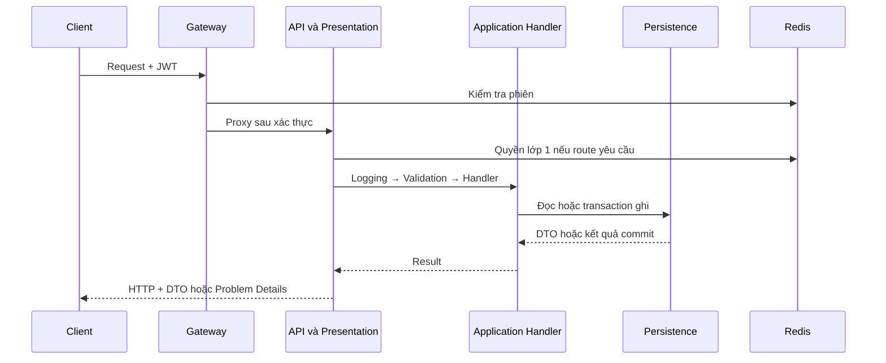
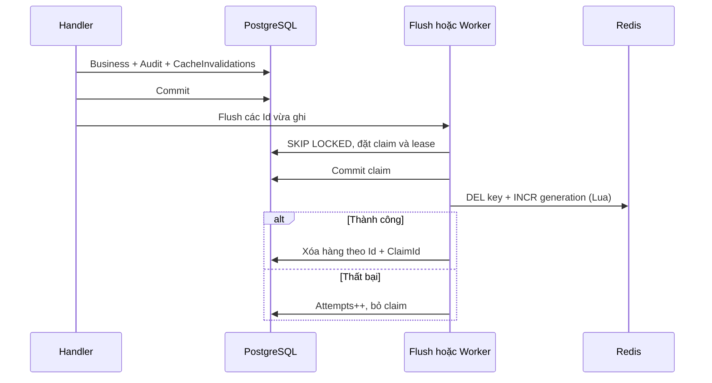

# Spec hiện trạng — kỹ thuật xuyên suốt backend

Ngày bắt đầu rà soát: 2026-10-03. Đây là mô tả code và đánh giá thiết kế, **không phải quyết định nghiệp vụ mới**. Kết quả chạy kiểm tra của phiên này nằm ở [spec.md](spec.md). Đường dẫn đầy đủ tính từ gốc repo; đường dẫn rút gọn `Application/...`, `Domain/...`, `Persistence/...`, `Infrastructure/...`, `Presentation/...`, `API/...` nằm dưới `benh_vien_be/src/QuanLyBenhVien.<layer>/`. Số sau dấu `:` là dòng bằng chứng tại mốc rà soát.

## 1. Luồng request và ranh giới kiến trúc

### 1.1 Trình tự thực tế

1. Gateway xử lý correlation, rate limit, JWT và trạng thái phiên rồi proxy tới API; chi tiết ở [01-auth-session-gateway.md](01-auth-session-gateway.md).
2. API áp `UseForwardedHeaders` trước khi lấy địa chỉ nguồn. Sau đó là correlation, exception handler và log request.
3. `UseAuthentication` tạo principal; `UserLogContextMiddleware` gắn actor/family vào log; `UseAuthorization` thực thi policy của endpoint.
4. `PasswordChangeGateMiddleware` chặn các route không được phép khi người dùng phải đổi mật khẩu.
5. Carter bind DTO của Presentation, tạo Command/Query và gọi `ISender.Send(..., ct)`.
6. Pipeline **hiện tại** là `LoggingBehavior → ValidationBehavior → Handler`. Không có `AuditBehavior` trong DI.
7. Command dùng aggregate/repository và `IUnitOfWork`; Query dùng read service trả DTO. Persistence cấu hình EF và truy vấn PostgreSQL; Infrastructure cung cấp Redis/token/hash/worker qua port.
8. Endpoint map `Result` sang response hoặc Problem Details; exception handler xử lý exception.

**Bằng chứng:** `benh_vien_be/src/QuanLyBenhVien.API/Program.cs:35`; `Application/DependencyInjection.cs:18`; `API/Composition/DependencyInjection.cs:23` (hai đường dẫn cuối cùng nằm dưới `benh_vien_be/src/QuanLyBenhVien.*`).

### 1.2 Vì sao chọn thiết kế này

Phân lớp là quy ước đã có trong AGENTS.md. Tách HTTP, use case, dữ liệu và adapter giúp đổi cách lưu trữ/host mà không đưa framework web vào nghiệp vụ. CQRS ở đây là **tách đường đọc/ghi trong cùng ứng dụng và cùng PostgreSQL**; code không chứng minh một hệ CQRS phân tán hay event sourcing.

**Điểm mạnh:** endpoint mỏng; DTO không phải entity; handler có thể được kiểm thử bằng port; DI tập trung tại API; Redis không cần tham chiếu Persistence; vertical slice giúp lần theo một use case.

**Điểm yếu:** một luồng phải mở nhiều file; interface tăng chi phí điều hướng; handler vẫn phải tự nhớ audit/invalidation/transaction đúng chỗ. Tách project không tự bảo đảm sở hữu bảng giữa các module. Hiện chỉ có module nền và danh mục tổ chức, chưa đủ bằng chứng đánh giá giao dịch xuyên module lâm sàng/viện phí.

**Đánh giá:** phù hợp monolith chia module. Chưa có lý do từ code hiện tại để chuyển sang microservice.

## 2. Validation và lỗi

### 2.1 Luồng validation

1. JSON/body không bind được tạo `BadHttpRequestException`; composition bật `ThrowOnBadRequest=true` ở mọi môi trường.
2. `ValidationBehavior` chạy các validator của request bằng `Task.WhenAll`, gom lỗi rồi ném `ValidationException` trước handler.
3. Handler kiểm điều kiện cần DB; lỗi dự kiến trả `Result.Failure(FeatureErrors.X)`.
4. Aggregate giữ bất biến nội tại; persistence vẫn có FK/unique/xmin làm hàng rào cuối khi request cạnh tranh.

**Vì sao:** validation hình dạng dữ liệu, kiểm điều kiện nghiệp vụ và constraint DB giải quyết ba loại lỗi khác nhau; kiểm ở validator không thay thế được constraint chống race.

**Điểm mạnh:** message có cấu trúc theo trường; handler tránh lặp kiểm tra hình dạng; mã lỗi ổn định; unique trong DB xử lý được hai request đều vượt qua precheck.

**Điểm yếu:** `Task.WhenAll` chỉ an toàn nếu validator không dùng đồng thời một scoped `DbContext`. Validator hiện tại chủ yếu kiểm thuần; đây là giới hạn mở rộng, không phải bằng chứng đang có lỗi. Bản đồ exception miền chưa đầy đủ: `GlobalExceptionHandler` chỉ xử lý `NotFoundException`, `BusinessRuleViolationException`, validation và bind; exception khác rơi về 500 nếu handler không bắt.

### 2.2 Hợp đồng lỗi

| Nguồn | Cách xử lý hiện tại |
|---|---|
| `ErrorType.Validation` / `Unauthorized` / `Forbidden` | 400 / 401 / 403 |
| `NotFound` / `Conflict` / `Precondition` / `TooManyRequests` | 404 / 409 / 412 / 429 |
| `Error.RetryAfter` | Header `Retry-After`, làm tròn lên và ít nhất 1 giây |
| Validation hoặc bind HTTP | 400 `validation_failed` |
| `NotFoundException` / `BusinessRuleViolationException` | 404 `not_found` / 409 `conflict` |
| Exception chưa map | 500 `internal_error`, body tiếng Việt chung |

Body có `type`, `title`, `status`, `code`, `traceId`; `errors` chỉ xuất hiện khi có lỗi trường. Khóa lỗi trường được chuyển camelCase. Không nên mô tả rằng mọi response luôn có `errors`.

**Bằng chứng:** `Presentation/Http/ResultExtensions.cs:8`; `Presentation/Http/ProblemResponses.cs:13`; `API/Middleware/GlobalExceptionHandler.cs:15`; `Application/Behaviors/ValidationBehavior.cs:24` dưới các project `QuanLyBenhVien.*`.

**Khuyến nghị:** khi thêm exception/constraint mới, quyết định rõ nơi map thay vì trông chờ catch-all. `ConcurrencyConflictException` hiện được xử lý bởi các handler tương ứng, không được global map tự động thành 412.

## 3. Transaction, khóa và concurrency

### 3.1 Cơ chế thực tế

- `AppDbContext` implement `IUnitOfWork`; các repository cùng scope dùng chung context.
- `BeginTransactionAsync` trả wrapper `AppDbTransaction`; `CommitAsync` xác nhận; dispose khi chưa commit rollback transaction.
- Handler tự quyết ranh giới; không có transaction behavior tự bọc mọi request.
- `SaveChangesAsync` dịch `DbUpdateConcurrencyException` sang `ConcurrencyConflictException`.
- Chỉ các unique constraint được liệt kê trong `TranslatedUniqueConstraints` mới được dịch sang exception phân biệt cho Application. Unique khác vẫn là `DbUpdateException`.
- Luồng phiên khóa User trước family/token; quản trị bảo vệ admin dùng advisory lock; các update danh mục dùng khóa hàng và RowVersion theo luồng cụ thể.
- SQL thô sử dụng interpolated APIs để tham số hóa. Không có cơ chế retry transaction `40P01`/`40001` toàn cục trong DI đã rà soát.

**Vì sao:** transaction phải thể hiện nhu cầu nghiệp vụ. Ví dụ reuse cần commit việc thu hồi dù kết quả HTTP là lỗi; wrapper transaction tự động rollback khi `Result.Failure` có thể phá yêu cầu này. Khóa hàng bảo vệ chuỗi đọc–kiểm–ghi, `xmin` bảo vệ quyết định của người dùng dựa trên phiên bản đã xem; hai cơ chế bổ sung nhau.

**Điểm mạnh:** commit có chủ đích; không gọi Redis trong transaction nghiệp vụ; constraint + khóa không phụ thuộc số instance; `xmin` do PostgreSQL thay đổi, không tự tăng tay.

**Điểm yếu:** reviewer phải kiểm từng nhánh return/dispose/commit; khóa có thể tăng thời gian chờ; xử lý `xmin` bằng cập nhật thuộc tính aggregate để làm root dirty là kỹ thuật cần hiểu trước khi bảo trì. `READ COMMITTED` không tự tạo snapshot nhất quán cho nhiều câu SELECT. Có exception dịch được không có nghĩa mọi endpoint đều trả đúng status.

**Bằng chứng:** `Persistence/AppDbContext.cs:24`, `:42`; `Persistence/AppDbTransaction.cs:13`; các khóa cụ thể được dẫn trong chương 01/02.

### 3.2 Khi nào dùng cơ chế nào

| Tình huống | Cơ chế hợp với code hiện tại | Giới hạn |
|---|---|---|
| Một lần ghi đơn giản | Một `SaveChangesAsync` | Không bảo vệ kiểm điều kiện bằng SELECT trước đó nếu thiếu constraint/lock |
| Rotation, revoke, đổi mật khẩu | Transaction + khóa User/family/token | Giữ khóa ngắn; các luồng phải cùng thứ tự |
| Luôn còn admin hoạt động | Transaction + advisory lock + khóa User | Chỉ đúng nếu mọi đường đổi bất biến cùng tuân thủ guard |
| Người dùng sửa dữ liệu cũ | RowVersion `xmin`, sai trả 412 | FE cần nạp lại và đối chiếu; không tự merge |
| Mã/email duy nhất | Unique index + map 23505 | Precheck chỉ giúp UX, không phải hàng rào cạnh tranh |
| Worker nhận công việc | `FOR UPDATE SKIP LOCKED` + claim | Chỉ dùng hàng đợi; không dùng như truy vấn danh sách nghiệp vụ nhất quán |

## 4. Quyền lớp 1 và cache permissions

### 4.1 Luồng tính quyền

1. Route có `RequirePermission` sinh requirement theo mã quyền.
2. `PermissionAuthorizationHandler` lấy `sub`; gọi `IPermissionService` scoped.
3. Service trả lại kết quả đã đọc trong request nếu có.
4. Nếu chưa có, đọc generation rồi `perm:{userId}`. Payload không hợp lệ hoặc Redis lỗi → đọc DB qua `IUserAccessReadService`.
5. `EffectivePermissions.LoadAsync` đọc `IsActive`/`MustChangePassword`; tài khoản inactive nhận tập quyền rỗng; active nhận hợp `RolePermission ∪ UserPermission`.
6. Cache miss và đọc generation thành công → ghi Redis có điều kiện generation, **không TTL**.
7. Handler phân biệt tài khoản không tồn tại/inactive → 401; phải đổi mật khẩu → 403 `password_change_required`; thiếu quyền → 403 `forbidden`; đủ quyền → đi tiếp.

Không có quyền phủ định: thu hồi `UserPermission` không loại bỏ quyền vẫn được cấp qua vai trò. `/me` và service quyền dùng chung phép tính DB, giảm nguy cơ UI và BE hiểu hai tập quyền khác nhau.

**Vì sao:** quyền hành động thay đổi thường ít hơn request; cache giúp giảm join. Không đưa tập permission vào JWT giúp tránh chờ JWT hết hạn để đổi quyền. Per-request memoization tránh đọc lại ở policy và password gate.

**Điểm mạnh:** DB vẫn là nguồn sự thật; Redis hỏng có fallback; cache payload được validate; người inactive không nhận quyền; quyền tập hợp dễ hiểu.

**Điểm yếu:** không TTL làm tính đúng đắn phụ thuộc hoàn toàn invalidation; join nhiều câu lệnh không bảo đảm snapshot nguyên tử với mọi thay đổi đồng thời. Cache ghi có điều kiện không ngăn kết quả cũ đã đọc được dùng cho request đang chạy. Không nên hứa thu hồi có hiệu lực tức thì ở mọi tình huống sự cố.

**Bằng chứng:** `Infrastructure/Identity/PermissionService.cs:15`; `Persistence/ReadServices/Identity/EffectivePermissions.cs:12`; `API/Security/PermissionAuthorizationHandler.cs:27`.

## 5. Cache invalidation bền vững

### 5.1 Luồng ghi và phát công việc

1. Handler gọi `InvalidateSession`/`InvalidatePermissions`; service scoped khử trùng theo key trong request.
2. Store thêm `CacheInvalidation` vào context, **chưa SaveChanges riêng**.
3. Business write + audit + invalidation được lưu cùng transaction hoặc cùng một `SaveChangesAsync`.
4. Commit xong mới `FlushAsync`; rollback thì hàng invalidation cũng biến mất.
5. Flush chỉ nhận các Id request đã enqueue; worker nhận các dòng chờ khác.

### 5.2 Luồng claim → Redis → ack

1. Processor tạo `claimId`, claim tối đa batch yêu cầu với lease **30 giây**.
2. Store từ chối chạy khi còn transaction nghiệp vụ. CTE chọn theo `CreatedAtUtc, Id`, `FOR UPDATE SKIP LOCKED`, UPDATE đặt claim rồi RETURNING.
3. Transaction claim commit trước khi gọi Redis.
4. Processor khử trùng key; eviction có timeout **10 giây**.
5. Thành công → `CompleteAsync` xóa hàng theo cả Id và `ClaimId`.
6. Thất bại khi caller chưa hủy → tăng `Attempts`, lưu tên loại lỗi an toàn, bỏ claim để retry. Từ 10 attempts nâng log lên Error.
7. Caller hủy → lease cho phép worker khác nhận lại sau hạn; business commit không bị đảo ngược.
8. Worker chạy lúc khởi động và mỗi **5 giây**, tối đa **100 dòng/lượt**.

### 5.3 Generation chống ghi lại cache cũ

Race cần chặn: request A đọc DB cũ → admin cập nhật DB và xóa cache → A ghi cache cũ, giữ mãi vì permissions không TTL.

Code đọc `{key}:gen` **trước** truy vấn DB. Khi ghi, Redis transaction chỉ SET nếu generation không đổi (hoặc vẫn chưa tồn tại). Eviction dùng Lua nguyên tử `DEL key → INCR gen → EXPIRE gen 1 ngày`. Vì vậy A không thể ghi kết quả cũ sau khi eviction đã tăng generation.

**Điểm mạnh:** không có cửa sổ DEL xong nhưng chưa INCR; chạy eviction lặp an toàn; worker nhiều instance không cần mutex trong RAM; business không giữ khóa DB khi chờ Redis; lỗi công việc không mất sau restart.

**Điểm yếu và giới hạn:**

- Đây là bảng chờ chuyên cho invalidation, **không phải Outbox nghiệp vụ tổng quát** có event payload/dedupe consumer.
- DB commit và Redis eviction không nguyên tử. Process chết sau commit, Redis gián đoạn rồi phục hồi hoặc backlog lớn tạo cửa sổ cache cũ còn dùng được. Permissions không TTL; session TTL tới hạn tuyệt đối family. Worker 5 giây không đồng nghĩa bảo đảm tối đa 5 giây khi có backlog/lỗi.
- Generation chỉ bảo vệ writer so với eviction; không đảm bảo DB đã commit thì mọi reader nhìn ngay dữ liệu mới.
- `{key}:gen` hết hạn hoặc bị Redis eviction độc lập làm mất hàng rào cho writer rất chậm; giới hạn thực tế cần timeout truy vấn/request, không xem generation là fencing token vĩnh viễn.
- Lua chạm nhiều key chưa có hash tag đồng slot. Thiết kế hiện hợp Redis standalone; triển khai Redis Cluster cần kiểm tra CROSSSLOT trước khi dùng.
- `CompleteAsync`/`FailAsync` lọc ClaimId nhưng không lọc lease còn hạn. Claim cũ không ack được sau khi claim mới đã đổi token; nếu chưa ai reclaim thì ack sau hạn vẫn có thể được nhận. Timeout ngắn hơn lease giảm khả năng này nhưng không phải chứng minh cứng khi process bị pause.
- Retry mỗi lượt chưa có backoff theo dòng, `NextAttemptAtUtc`, dead-letter hoặc metric tuổi backlog. Một batch lỗi có thể tiếp tục ưu tiên dòng cũ, làm tăng trễ thu hồi quyền phía sau.
- `FlushAsync` không nuốt `OperationCanceledException`: sau commit client có thể không nhận thành công; đây là kết quả delivery, không phải rollback business.

**Bằng chứng:** `Application/Common/Caching/CacheInvalidator.cs:27`; `CacheInvalidationProcessor.cs:8`, `:37`; `Persistence/Caching/CacheInvalidationStore.cs:21`; `Infrastructure/Caching/GuardedCacheWrite.cs:15`, `:27`; `CacheInvalidationWorker.cs:14`.

**Khuyến nghị ưu tiên:** định nghĩa bảo đảm thu hồi khi invalidation chậm. Nếu yêu cầu request mới phải bị chặn ngay sau commit, cần cơ chế kiểm chứng version/invalidation bền vững ở đường đọc hoặc phương án kiểm DB; chỉ đổi TTL không chứng minh yêu cầu đó. Bổ sung bài test crash sau commit, Redis phục hồi còn key cũ, backlog và reclaim sau lease.

## 6. Nền phân quyền lớp 2

### 6.1 Luồng hiện có

1. `IAccessContext.GetAsync` yêu cầu `UserId`, tìm `StaffProfile` đang active.
2. Join `StaffWorkScope → Department → Branch`, chỉ giữ khoa và cơ sở active; lấy BranchId từ quan hệ Department thật.
3. Tạo tập cơ sở/khoa; memoize **trong scope request**. Không cache Redis hoặc giữa request.
4. `ResourceAuthorizer` tra đúng cặp `(permissionCode, resourceType)`.
5. Không policy → log và `Denied("no_policy")`; thiếu work scope → `Denied("no_work_scope")`.
6. Có policy → gọi `EvaluateAsync(scope, resource.Id, TimeProvider.GetUtcNow(), ct)`.

**Trạng thái:** đã có port, access context, dispatcher và audit từ chối. Không thấy implementation nghiệp vụ của `IResourceScopePolicy` được đăng ký; chưa có `CareTeamAssignment`/`AccessGrant`/resource lâm sàng trong model hiện tại. Do đó chưa thể kết luận AT-09/AT-10/AT-17 đã được thực thi cho bệnh án/tệp.

**Vì sao:** permission lớp 1 trả lời loại hành động; lớp 2 trả lời tài nguyên cụ thể. Đọc quan hệ mới từ DB ở mỗi request đáp ứng yêu cầu thu hồi phân công. Dispatcher thiếu policy thì từ chối giúp tránh cấp quyền mặc định khi quên implement.

**Điểm mạnh:** tách policy theo tài nguyên; không tin scope JWT cũ; scope lấy từ cha thực; fail closed khi thiếu policy.

**Điểm yếu:** marker không phải middleware tự thực thi. Handler/query tương lai vẫn phải gọi authorizer và áp scope vào SQL trước COUNT/paging. Dispatcher không tự kiểm quyền lớp 1, trạng thái User hoặc BranchId của tài nguyên; bước đó phải do cửa route và policy đảm nhiệm. Gọi thẳng MediatR từ host khác không có bảo đảm web authorization.

### 6.2 Kiểm soát bằng architecture test

`ScopedRequestRules` kiểm request trong nhóm `ReceptionQueue`, `Clinical`, `Inpatient`, `Billing`, `Documents`, `Pharmacy`, `Facilities`, `StaffProfiles`: thiếu marker thì báo; có cả hai marker thì báo; `IUnscopedRequest` phải nằm trong `ApprovedUnscopedRequests` với lý do. Facilities/StaffProfiles hiện được duyệt unscoped do là quản trị nền.

**Giới hạn:** namespace feature mới hoặc đổi tên không nằm trong `GovernedFeatures` có thể né kiểm tra thiếu marker. Test này không chứng minh handler thật gọi policy hay danh sách lọc trước pagination. Cần integration test theo module khi triển khai, không coi marker là hàng rào runtime.

**Bằng chứng:** `Persistence/Authorization/AccessContext.cs:19`; `ResourceAuthorizer.cs:27`; `tests/QuanLyBenhVien.UnitTests/Architecture/ScopedRequestRules.cs:9`; `ApprovedUnscopedRequests.cs:21`.

## 7. Audit: ba đường khác nhau

| Đường | Đặc tính hiện tại | Khi lỗi |
|---|---|---|
| `AuditSaveChangesInterceptor` → `AuditLogs` | Diff entity `IAuditable`, cùng SaveChanges; loại PasswordHash/TokenHash/concurrency property | Ghi dữ liệu cũng thất bại |
| `IAuditWriter.Record` → `AuditRecords` | Chỉ Add vào context; metadata tối đa 4096 byte; caller phải Save/commit | Phụ thuộc caller; rollback business rollback record cùng context |
| `IDeniedAccessRecorder` → `AuditRecords` | Context riêng từ factory; bỏ request cancellation; dành từ chối lớp 2 sau rollback | Log lỗi, giữ quyết định từ chối; không ném lại |

### 7.1 Vì sao tách

Audit diff trả lời dữ liệu đã đổi gì; audit hành động trả lời ai làm/xem/từ chối việc gì. Từ chối sau khi transaction business rollback không thể ghi vào cùng transaction vì record cũng mất; context riêng giải quyết điều đó. Route thiếu permission lớp 1 ghi audit và SaveChanges **trước** trả 403; lỗi audit làm request bị lỗi, không chạy handler.

**Điểm mạnh:** không lưu hash mật khẩu/token trong diff; audit thay đổi nguyên tử với business; rollback vẫn giữ được denied record qua đường riêng; metadata giới hạn kích thước; actor/correlation/source đi qua port.

**Điểm yếu:**

- Chưa có `IAuditedRequest` và `AuditBehavior` như TSD §3.3/AGENTS.md yêu cầu cho dữ liệu nhạy cảm. Không áp dụng suy luận rằng interceptor ghi mọi lượt đọc; Query không SaveChanges và interceptor chỉ xử lý mutation.
- Interceptor dùng blacklist hai tên property, không có projection audit theo loại dữ liệu; entity PHI tương lai cần policy diff giới hạn trước khi bật `IAuditable`.
- `AuditLog.Create` dùng `DateTimeOffset.UtcNow`; thời gian không cùng clock inject với `AuditWriter`/handler. DomainEvent và một số fallback `User` cũng còn thời gian trực tiếp.
- Interceptor không có cơ chế đánh dấu diff đã thêm nếu cùng context SaveChanges thất bại rồi retry; cần kiểm chứng trước khi thêm retry nghiệp vụ.
- `DeniedAccessRecorder` dùng `CancellationToken.None` để client hủy không làm mất log; tradeoff là request có thể chờ DB lâu hơn. Nên có timeout vận hành riêng, không tái dùng request token.
- Domain events hiện được `Raise` và EF ignore; không thấy dispatcher/Outbox consumer trong runtime. Không được suy rằng phát domain event đã tự gửi thông báo hoặc tự xóa cache.

**Bằng chứng:** `Persistence/Interceptors/AuditSaveChangesInterceptor.cs:12`, `:37`; `Persistence/Repositories/Common/AuditWriter.cs:36`; `Persistence/Authorization/DeniedAccessRecorder.cs:28`; `API/Security/ProblemAuthorizationResultHandler.cs:57`; `Domain/Common/Auditing/AuditLog.cs:25`; `Domain/Common/AggregateRoot.cs:5`.

## 8. Migration, seeder và khởi động

### 8.1 Trình tự

1. API xây host, map endpoints rồi gọi `InitializeDatabaseAsync` trước `RunAsync`.
2. Nếu `Database:MigrateOnStartup=true`, chạy EF migration.
3. Seeder đồng bộ catalog Permissions từ code, thêm system roles còn thiếu và phục hồi quyền lõi Admin.
4. `RoleDefaultsApplier` mở transaction + advisory lock riêng; tính cặp mặc định đã kích hoạt/chưa có lịch sử.
5. Thêm quyền và `RolePermissionDefaults`, enqueue invalidation cho người giữ vai trò, Save → commit → Flush.
6. Cuối cùng tạo admin đầu tiên nếu chưa có UserRole trỏ tới admin role và cấu hình seed đủ.

### 8.2 Lý do và đánh đổi

Lịch sử `(RoleId, PermissionCode)` bảo đảm admin đã bỏ quyền mặc định thì restart không gán lại. Quyền lõi Admin là ngoại lệ bảo vệ khả năng quản trị. Mã quyền chỉ kích hoạt khi có endpoint giúp không cấp sẵn chức năng chưa nghiệm thu.

**Điểm mạnh:** ma trận quyền có một nơi quản lý; default chỉ áp một lần; advisory lock bảo vệ applier nhiều instance; invalidation đi cùng thay đổi quyền.

**Điểm yếu:** advisory lock chỉ bao quanh `RoleDefaultsApplier`, không bao quanh đồng bộ catalog/system roles/tạo admin đầu tiên. Hai host khởi tạo DB mới có thể cùng đọc chưa có rồi cùng insert trước khóa applier, khiến một host lỗi unique lúc startup. Đây là kịch bản suy ra từ code, chưa tái hiện trong phiên review; test concurrency applier không chứng minh toàn seeder an toàn. Check tạo admin đầu tiên nhìn UserRole, không chứng minh có admin active; nó không phải công cụ tự phục hồi admin bị khóa ngoài use case.

**Bằng chứng:** `Persistence/Seed/DbInitializer.cs:11`; `IdentitySeeder.cs:33`, `:41`, `:56`, `:86`; `RoleDefaultsApplier.cs:17`.

**Khuyến nghị:** test hai host gọi **toàn** `SeedAsync` trên DB mới, quyết định lock/idempotent upsert cho bootstrap; giữ nguyên lịch sử migration đã commit. Không chạy migration hoặc seed vào DB dùng chung trong tác vụ review này.

## 9. Log, correlation và health

### 9.1 Log/correlation

Correlation nhận `X-Correlation-Id` hợp lệ tối đa 128 ký tự `[A-Za-z0-9._-]`, nếu sai tạo mới; gắn request/response/TraceIdentifier và log context. LoggingBehavior chỉ ghi tên request và thời gian, không destructure payload use case. Password/token property trong object destructured được che bởi `SensitiveDataDestructuringPolicy`.

**Điểm mạnh:** tra lỗi theo một mã xuyên Gateway/API; không log trực tiếp command/body trong behavior; forwarded headers chỉ tin proxy cấu hình.

**Điểm yếu:** destructuring policy không tự che string, exception message hoặc mọi dictionary/PHI. Các chỗ `LogError(exception, ...)`/`LogWarning(ex, ...)` vẫn cần kiểm tra chính sách exception; không nên khẳng định có policy là mọi log an toàn. Chưa kiểm hệ log production/retention/metric trong review này.

### 9.2 Health thực tế và khoảng trống

API và Gateway map `/health` anonymous. Infrastructure **chỉ đăng ký Redis health**, failureStatus Degraded. File `DatabaseHealthCheck.cs` còn nhưng bị `<Compile Remove>` và dùng namespace persistence cũ; không chạy trong host hiện tại. Vì thế DB hỏng nhưng Redis khỏe có thể vẫn làm API health báo khỏe.

**Vì sao cần bổ sung:** PostgreSQL là nguồn sự thật của mọi nghiệp vụ; readiness không nên chỉ chứng minh cache còn sống. Worker invalidation có lỗi/backlog cũng không phản ánh trong check Redis ping.

**Bằng chứng:** `Infrastructure/DependencyInjection.cs:59`; `Infrastructure/QuanLyBenhVien.Infrastructure.csproj:24`; `API/Program.cs:54`.

**Đánh giá:** thiếu PostgreSQL readiness là phát hiện xác nhận từ DI/project, ưu tiên P1 cho vận hành. Adapter DB health mới phải thuộc layer đúng (hoặc qua port), không đưa EF trở lại Infrastructure.

## 10. Kiểm chứng và giới hạn kết luận

Các suite liên quan: `Architecture/ScopedRequestRulesTests`, `Application/Common/Caching`, integration `Caching/CacheGenerationRaceTests`, `CacheInvalidationDeliveryTests`, `Authorization/PermissionServiceTests`, `PermissionCacheInvalidationTests`, `AccessContextTests`, `DeniedAccessRecorderTests`, `AuthorizationPipelineTests`, `Admin/RoleDefaultsSeederTests`.

Test hiện có chứng minh từng kịch bản được assertion; không tự chứng minh toàn hệ chịu được Redis phục hồi còn cache cũ, mọi policy lớp 2, seeder mới khởi động đồng thời hoặc request feature FE sau logout. Kết quả mới chạy và các ca chưa chạy được phân biệt trong [spec.md](spec.md). Không sửa source trong review này.
